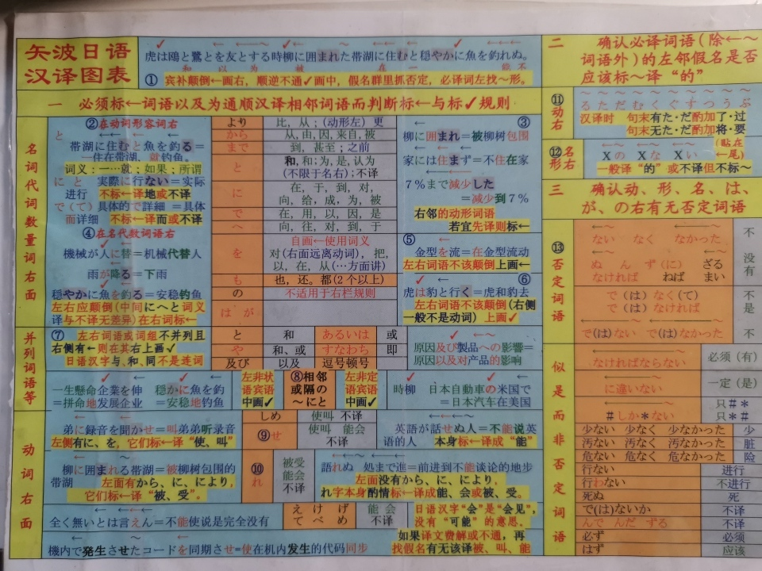
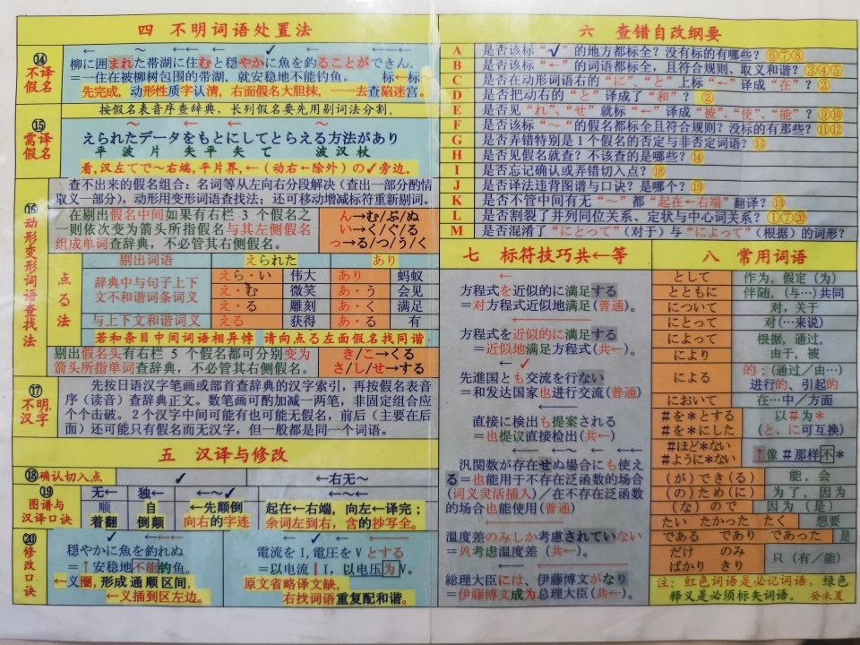

# yaba-japanese やば日本語

一天速成日语，阅读科技文献

《矢波日语》 关永昌 张慧琴 关树暄 著

## 介绍

详情介绍见：[如何评价「日文里有汉字，没学过也能大概看得懂」这类说法？ - 小德的回答 - 知乎](https://www.zhihu.com/question/44769704/answer/773550786)

矢波日语扫描版，感谢[小德](https://www.zhihu.com/people/guo-wei-12-52)提供的珍贵原书，以及[叶痕](https://www.zhihu.com/people/murata/activities)提供的分页扫描件。

汉译图表在本页的最底部 ↓ 。

## 下载地址

[Release](https://github.com/linonetwo/yaba-japanese/releases)，点开 Assets 可看到 default.pdf

或直接点击 [矢波日语.pdf](https://github.com/linonetwo/yaba-japanese/releases/download/v1.0/default.pdf) 下载

百度网盘链接:https://pan.baidu.com/s/1sTMam4A9u4on6ab2d9VrAA  密码:f38j

## 序言

由于掌握一门外语往往需要拿出「铁杵磨绣针」的耐心和恒心，特别是非专业外语没有十来年的不懈努力往往口不能讲，笔不能译。所以长久以来人们一直在寻找外语学习的捷径，并且也不同程度地发现和总结出一些行之有效的方法，在实际教学和应用中取得了良好的效果。而对和汉语有着相同相近的词形和词义的日语，人们自然看到学习相对容易的一面，但是日语由于语法繁琐，尤其是动词词尾变化复杂，所以就被挂上一个「学习日语笑着进去哭着出来」的不大光彩的「幌子」。尽管国内外许多学者也推出了一些可圈可点的日语速成法，但是，总的来说基本上都是在传统语法的统治下讨生活，在繁琐的语法特别是动词词尾变化面前却都有心变革，无力回天。

而如何利用日语使用汉字的有利条件，消除其语法繁难的不利因素，使具有一定文化程度即认识一定汉字 ———— 一般说来是具有高中文化基础的中国人，在更短的时间内掌握足以实用的对日语科技文章的汉译，这是笔者一直潜心研究的课题。经过多年教学实践与总结，最后成功地创造出「矢波杖」 3 个符号，完全取代日语语法，并形成一套完整的理论体系。终于使学习日语可以「笑着进去笑着出来」了！矢波日语从字母即假名发音开始（ 0 起点），仅用 24 学时课堂教学就可以使学习者借助工具书汉译日语科技文章。仅就读译而言，这对于母语是汉语的中国人来说，矢波日语已经把日语学习从必须花费数年「铁杵磨绣针」工夫的外语学习理念中解放出来，变成只要有高中以上文化程度的人谁都可以轻易地掌握的有用技能。

而且，由于矢波日语极其简单，即使学完之后长期不用而生疏遗忘（掌握任何一种技艺，倘若经常不用，那么遗忘是必然的），但是急需之时，拿出 2 - 3 天的时间复习一下，就可恢复其汉译日语的能力。比把保存在电脑中的材料提取出来并不困难多少。同时，也给日语的口语速成教学创造了极其有利的条件。因为口语和科技文章相比句子短，语法简单，所以掌握了矢波日语之后学习口语，就不必再学习语法，把全副精力都用到记单词、读课文、练习会话上。根据笔者用矢波方法教授《中日交流标准日本语》（北京：人民教育出版社， 2000 ） 的经验，初级上册节省三分之一的时间，并且效果好，很受学生的欢迎；下册计划用该书规定时间的二分之一完成教学。

94 年在讲授 80 学时的二外日语选修课时，就开始探索日语速成教学法。在这期间恰巧接受某翻译公司一批日译汉资料,平均每天翻译 1 万多字（完全手写于稿纸）,47 天完成 55 万字，无意中感觉到汉译日语的翻译活动似乎变成了一种机械运动，日汉两种语言的语序也有一种机械的对应关系。 这就为探索日语速成法撞开了一扇大门，看到了一条捷径。于是因利乘便搞出反映日汉语序这种机械对应关系的几个符号并应用于教学。通过在教学实践中反复改进，现在完善为矢、波、杖 3 个符号。

以往无论什么日语速成法都没有彻底摆脱传统语法的束缚，所以无论速度上还是效果上都不理想。矢波日语用赋予一定意义、规定一定标示规则而标示在日语原文上的矢波杖 3 个符号完全取代日语语法；并且把赋予这 3 个符号的意义与标示规则铸成简单得包括标点仅 34 个字的 1 个句子里；而 3 个符号在这 1 个句子里所形成的 4 种不同的组合形式则囊括了日汉两种语言语序的所有对应关系，这些对应关系用 6 句口诀（包括 2 句修改口诀）表述出来从而引导汉译操作。3 个符号、1 个句子、6 句口诀就是 24 学时汉译超速成矢波日语的全部方法，也是矢波日语之所以如此神速地使学习者获得汉译日语科技文章能力的根本原因。日语假名的识记相当困难。94 年开设第 1 期日语选修课教授假名时，教师使出浑身解数，但学生仍叫苦不迭。有位学生问：「这记假名有没有什么好方法?」教师当时摇摇头，但过后很内疚。于是，就在 95 年初创造出「形音向导假名教学法」，仅用 4 学时教学就可以让学习者当场默写下来平片 2 种假名。假名形音向导教学法，是矢波日语最得力的伙伴。

经过 20 期学习班包括科研部门和企事业干部、大学教师、博士生、硕士生、本科生、专科生、成教生、高职生以及待业青年等 1100 多人的共同努力一他们或是取得优异成绩增强了矢波教师前进的信心，或是提出合理要求提示了矢波日语改进的方向一矢波日语才取得今天的成果。现在借矢波日语正式出版的机会谨向所有关心、支持矢波日语的学生、教师、学校各级领、社会各界朋友致以衷心的感谢。

从动手搞日语速成法的 1994 年到现在已经是 9 年半的时间。虽然矢波日语与其他任何速成法都有着泾渭分明的界限，但是笔者从耳目所及的所有日语速成教材中都受到了启迪，起码支撑着搞速成日语愿望之火没有熄灭。 1996 年笔者忝为《科技日语速修教程》主编汪大捷先生从教 65 周年暨 90 寿辰庆祝活动的会议发起人之一，为此曾度《扶桑曲》，现在抄录在下面，以表示对所有搞速成日语的同行与前辈的敬谢之意。

> 安以宇讲台屡登，矢波杖人世初生，《速修》 乳汁丰。

> 喜长成，手擎《代序》踏征程，金光大道高歌万里行。

本书的分工如下：关永昌负责全书总体设计以及第一、二、三章的撰写；张慧琴负责第四章与《小小辞典》的撰写；关树暄负责第五章的撰写与《汉译图表》的制作。由于时间仓促，水平有限，错误之处在所难免，敬请广大同仁提出宝贵意见。

作者
2003.6

## 关于缺失的页码

84-163 是 2 个长文例子分析和原文，冗杂暂不扫描；196-297 是作业训练，于原书已被撕去，湮没于历史中。

## 汉译图表

